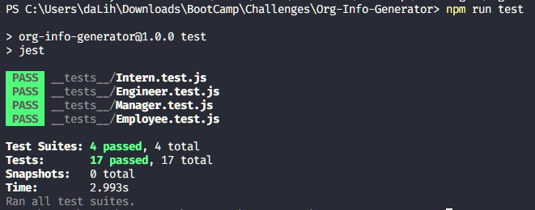

# Org Info Generator
  

## Description

A command line Org Info Generator written with Node.js .

## Table of Contents

- [Org Info Generator](#org-info-generator)
  - [Description](#description)
  - [Table of Contents](#table-of-contents)
  - [Installation](#installation)
  - [Usage](#usage)
  - [Contributing](#contributing)
  - [Tests](#tests)
  - [License](#license)
  - [Questions](#questions)

## Installation

`git clone` the whole project and run `node index.js` in project root folder.

## Usage

You can use the code in any way you think fit. Just have fun!

## Contributing

Anyone can contribute. Feel free to raise issues.

## Tests

Simply run `node run test` in project root folder.

Test result on my machine: 

## License

This project is licensed under the MIT license.

## Questions

If you have any questions, you can contact me via [Email](ross4han@gmail.com). You can also visit my GitHub profile at [GitHub](https://github.com/dearbojack).

* This README file was generated with README [README ROBOT R2](https://github.com/dearbojack/README-ROBOT-R2).